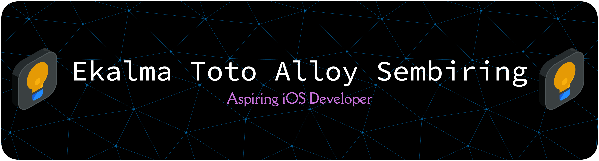

# 🚀 iOS Development Journey 🚀

### 🌟 Current Journey

I'm currently building my skills to become a professional iOS Developer by learning Swift from the ground up. Every repository documents my progress, projects, and lessons learned along the way.

---

## 📂 Featured Projects

| Project             | Description                                  |
| ------------------- | -------------------------------------------- |
| 💻 iOS Swift Basics | Learn the fundamentals of Swift programming. |

---

## 🎯 Road to iOS Developer

- 📚 Master Swift Fundamentals
- 📱 Learn UIKit & SwiftUI
- 🏗 Build 20+ Real-World iOS Projects
- 🧩 Understand MVVM & Clean Architecture
- 🌐 Integrate REST APIs
- 🗄 Learn Core Data & SwiftData
- 🚀 Publish Apps on the App Store
- 💼 Land My First iOS Developer Job

---

## 📈 2026 Goals

🎯 Complete every repository in my iOS roadmap.

🎯 Build 20 production-ready iOS applications.

🎯 Solve 100+ algorithmic problems on Codechef.

🎯 Contribute to open-source projects.

🎯 Join Apple Developer Academy.

🎯 Start my professional career as an iOS Developer.

---

## 💡 Philosophy

> "Small progress every day is better than perfection someday."

I'm documenting every step of my journey—not just the successes, but also the challenges and lessons learned.

## Tech Stack

  
  
  
  

  

